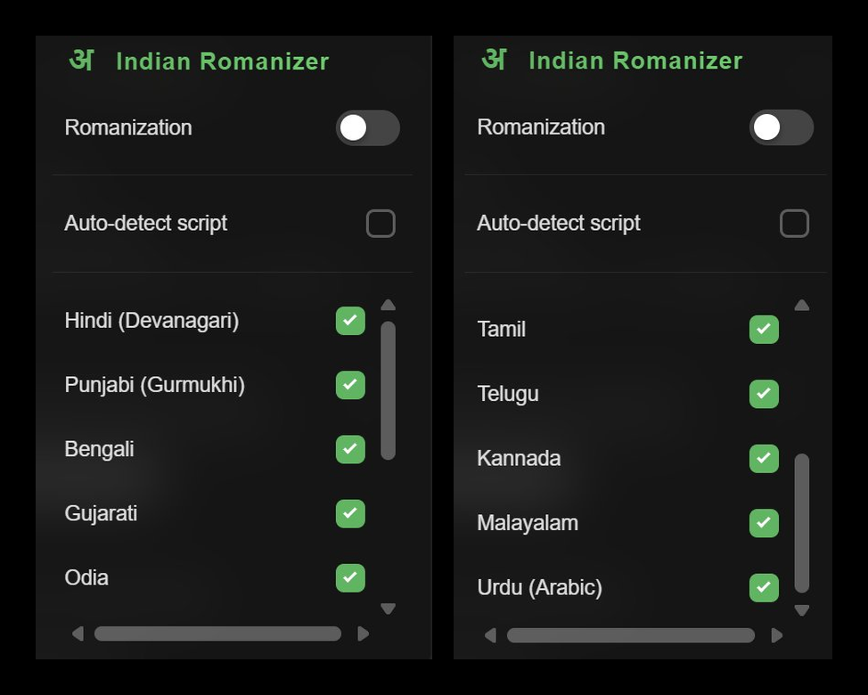
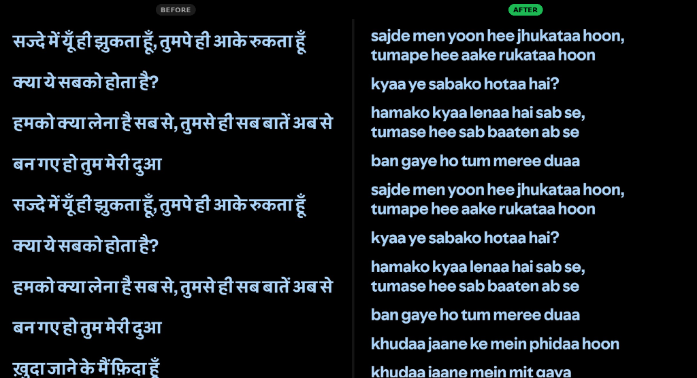
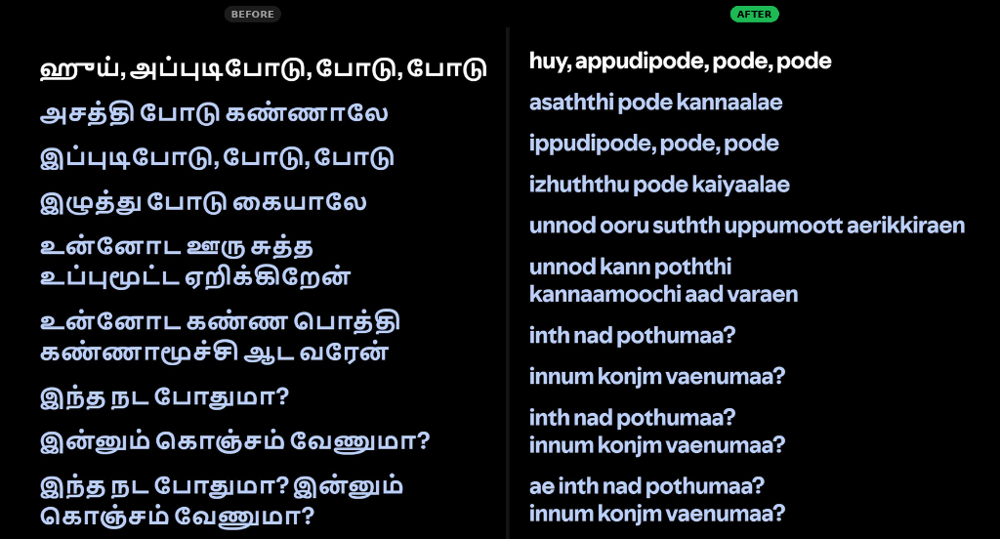

# 🇮🇳 Indian Lyrics Romanizer

A Spicetify extension that romanizes Indian script lyrics into phonetic English directly in Spotify's lyrics panel.



## Supported Scripts

| Language   | Script     | Unicode Range   |
|------------|------------|-----------------|
| Hindi      | Devanagari | U+0900–U+097F   |
| Punjabi    | Gurmukhi   | U+0A00–U+0A7F   |
| Bengali    | Bengali    | U+0980–U+09FF   |
| Gujarati   | Gujarati   | U+0A80–U+0AFF   |
| Odia       | Odia       | U+0B00–U+0B7F   |
| Tamil      | Tamil      | U+0B80–U+0BFF   |
| Telugu     | Telugu     | U+0C00–U+0C7F   |
| Kannada    | Kannada    | U+0C80–U+0CFF   |
| Malayalam  | Malayalam  | U+0D00–U+0D7F   |
| Urdu       | Arabic/Nastaliq | U+0600–U+06FF |

## Features

- **Topbar button** with the universal Indian script symbol **अ**
- **Floating dropdown panel** with:
  - Master ON/OFF toggle
  - Per-script checkboxes
  - **Auto-detect** mode — automatically identifies which script is in the current lyrics
- Button glows green when active, dims when off
- Clicking outside the dropdown closes it
- All settings persisted in `localStorage`
- Original lyrics perfectly restored when toggled off

## Previews

### Devanagari (Hindi) Comparison


### Tamil Comparison



## Installation

1. Make sure [Spicetify](https://spicetify.app/) is installed.
2. Copy `indian-romanizer.js` to your Spicetify extensions folder:
   ```
   %appdata%\spicetify\Extensions\
   ```
3. Run:
   ```bash
   spicetify config extensions indian-romanizer.js
   spicetify apply
   ```

## Usage

- Click the **अ** button in the Spotify topbar to open the panel.
- Toggle the master switch ON.
- Either enable **Auto-detect** or manually check the scripts you want romanized.
- The lyrics will be phonetically rendered in real time.
- Toggle OFF to restore the original Indian script text.

## License

MIT
